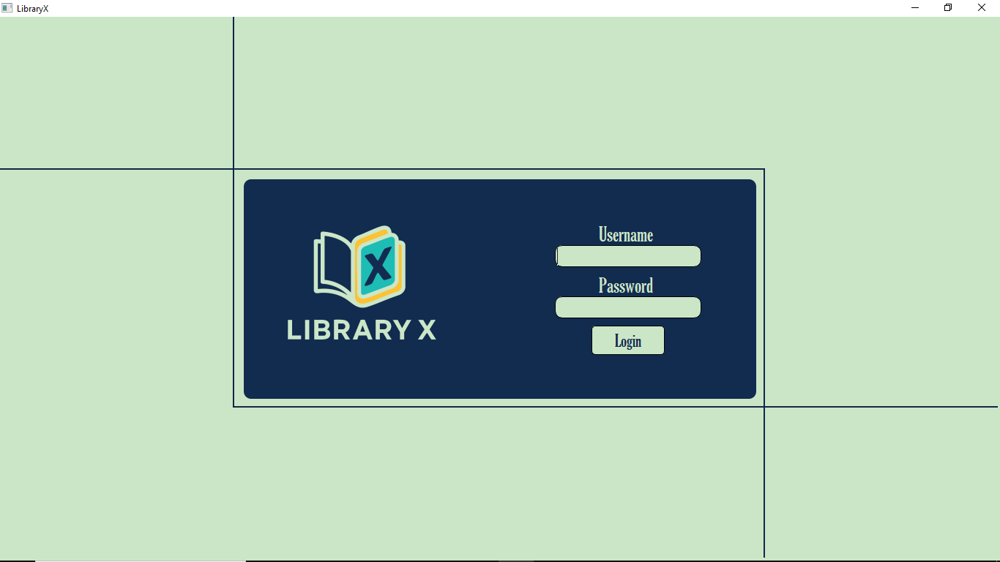
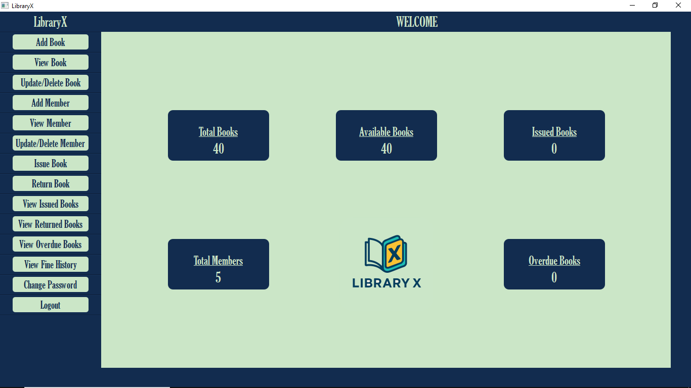

# LibraryX – Library Management & Fine Calculation System

LibraryX is a Python-based library management system that simulates real-world library operations such as book inventory management, member handling, book issuing, book returning, and fine calculation using a relational database.

## Features

### Book Management
- Add books
- Update books
- Delete books
- View books

### Member Management
- Add members
- Update members
- Delete members
- View members

### Issue & Return System
- Issue books with due dates
- Return books
- Maintain issued books records
- Automatic fine calculation on return

### Fine Calculation
- Calculates overdue fines per day

### Reports
- View issued books
- View returned books
- View overdue books
- Fine history tracking

### Dashboard
- Displays real-time counts
- Shows system overview

## Tech Stack
- Python
- PyQt5
- SQLite3
- VS Code

## Screenshots

### Login Screen

### Main Dashboard

## How To Run

- Clone the repository
- Ensure Python is installed
- Install required dependencies : PyQt5
- Run the application

## System Architecture

- Books  
- Members  
- Issue Module  
- Return Module  
- Fine Calculator  
- Reports

## Notes
- All data is stored using SQLite
- Overdue books are automatically detected
- Fines are calculated based on overdue days
- Dialog-based UI keeps the main dashboard active

## Project Purpose

This project was developed as part of an internship to gain hands-on experience with:
- GUI development
- Database-driven applications
- Real-world management system logic

## Author

Adesh Prabhune
